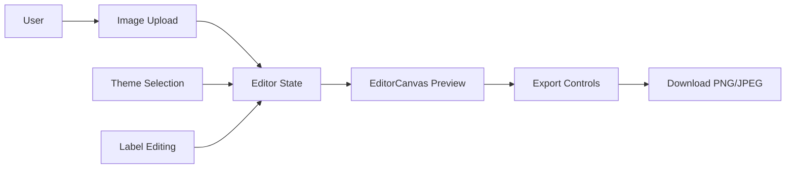

## Goals

Build a modern React (Next.js) application named **Before-After Image Editor** that lets users upload a “Before” and “After” image, preview them inside a strict **4:5** framed canvas with editable labels and theme backgrounds, then export the result as **PNG or JPEG** at a locked **4:5** ratio.

## Architecture (data flow)

## Proposed Component/File Structure

- `app/page.tsx`: Next entry, renders the editor client component.
- `app/EditorPage.tsx` (`"use client"`): owns editor state + wires toolbar/canvas.
- `components/EditorCanvas.tsx`: strict **4:5** frame, background theme, stacked image areas, labels.
- `components/Toolbar.tsx`: floating toolbar (upload, theme select/upload, swap, export).
- `components/ImageUploader.tsx`: drag & drop + file picker; validates PNG/JPG/JPEG.
- `components/ThemeSelector.tsx`: built-in themes list (15-20) + custom background image upload.
- `components/TextEditor.tsx`: controls font size/color/alignment for each label.
- `components/EditableLabel.tsx`: inline editing UI for “Before”/“After” strings.
- `lib/themes.ts`: built-in theme definitions.
- `lib/export.ts`: html2canvas export + locked 4:5 dimensions.
- `lib/imageUtils.ts`: file validation, reading, aspect-ratio helpers.

## Key UI/Rendering Requirements

1. **Strict 4:5 canvas**
  - Use Tailwind arbitrary aspect ratio: `aspect-[4/5]` on the outer editor frame.
  - Center workspace responsively and keep consistent padding/gap.
2. **Stacked layout**
  - Two stacked regions inside the frame:
    - Top: “Before” image + label overlay
    - Bottom: “After” image + label overlay
  - Gap + padding are fixed via Tailwind utilities so export matches preview.
3. **Object-fit intelligent choice**
  - When an image loads, compare image aspect ratio vs the rendered sub-frame aspect ratio to decide:
    - use `objectFit: "cover"` when the image is “wider” than the slot
    - use `objectFit: "contain"` otherwise
  - Always center (`objectPosition: "center"`).
4. **Editable labels + styling**
  - Inline editing of “Before” and “After”.
  - Controls for font size, color, and alignment (left/center/right) per label.
5. **Theme system**
  - Built-in themes: provide **15–20** entries mixing:
    - gradients (blue/purple/sunset/neon/ocean/aurora/etc.)
    - grid background (CSS repeating grid)
    - solid colors
    - subtle pattern variants
  - Custom background image upload:
    - read as Data URL
    - apply to full canvas background (`background-size: cover`, `background-position: center`).
6. **Swap**
  - Instant swap of:
    - before image + after image
    - before label text + after label text
    - and each label’s style settings (font size/color/alignment) to match expectations.
7. **Export (PNG + JPEG)**
  - Use `html2canvas` to render `EditorCanvas` at a locked **4:5** size.
  - Default export dimensions: **1080×1350** (4:5), enforce ratio if user ever changes size.
  - PNG: `image/png`.
  - JPEG: `image/jpeg` with configurable quality (default ~0.92).
  - Client-only dynamic import for `html2canvas` to avoid SSR issues.

## Implementation Plan (todos)

1. Scaffold Next.js + Tailwind project in this empty workspace.
2. Implement editor state model (images, label texts, label styles, theme, custom background).
3. Build `EditorCanvas` with strict aspect ratio + layered preview (background -> image slots -> labels).
4. Implement upload UX with drag & drop + validation.
5. Implement theme selector UX (built-ins + custom background).
6. Implement inline label editing + text styling controls.
7. Add swap button wiring.
8. Add export UX (PNG/JPEG) using html2canvas with locked 4:5 export sizing.
9. Add smooth UI transitions (swap animations, toolbar affordances) and basic error messaging.
10. (Optional, if time) Add drag-to-reposition + zoom for images, and undo/redo for state changes.

